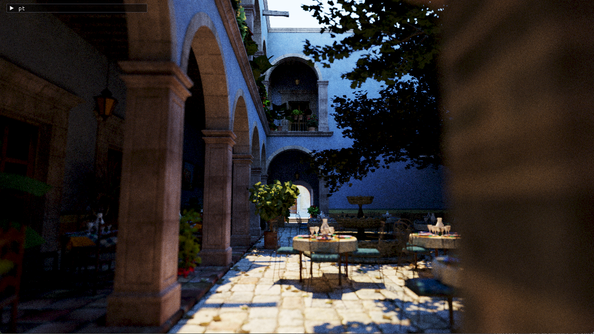

# rayfinder assets

Additional 3d assets that can be used with the [`rayfinder`](https://github.com/nelarius/rayfinder) renderer. glTF files are tracked using Git LFS.

```sh
# After installing Git LFS:
$ git lfs install
# After cloning this repo:
$ git lfs pull
```

## McGuire Computer Graphics Archive

Link: [casual-effects.com/data/](https://casual-effects.com/data/)

The MgGuire Computer Graphics Archive provides a number of 3d assets in the OBJ format that can be used in a renderer. Converted from the OBJ format to glTF using [obj2gltf](https://github.com/CesiumGS/obj2gltf).

```sh
$ npm install -g obj2gltf
$ obj2gltf -i rungholt.obj -o rungholt.glb
```

### `rungholt.glb`

Source: [www.planetminecraft.com/project/neu-rungholt/](https://www.planetminecraft.com/project/neu-rungholt/)

License: CC BY 3.0


### `san-miguel-low-poly.glb`

Source: [Guillermo M. Leal Llaguno](http://www.evvisual.com/)

License: CC BY 3.0


